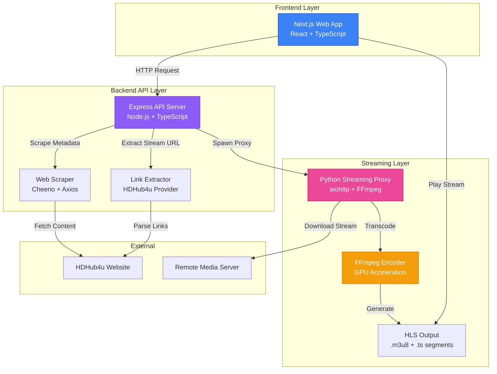
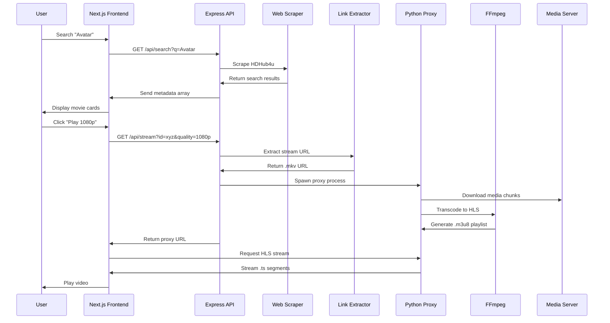

# 🎬 Movies Streaming

A comprehensive media streaming solution featuring a **Modern Next.js Web Interface**, a **robust Node.js API Backend**, and a **Python-based Streaming Proxy**. This project allows you to search for movies/series, extract high-quality streaming links, and play them directly in your browser with GPU-accelerated transcoding.

---

## 📊 Architecture Overview



---

## 🔄 Request Flow Diagram



---

## ✨ Key Features

### 🎨 Modern Web Interface
- **Netflix-inspired UI** with responsive design
- **Real-time search** with instant results
- **Quality selection** (480p, 720p, 1080p, 2160p)
- **Integrated video player** with Plyr.js
- **Mobile-optimized** for all devices

### ⚡ High-Performance Backend
- **Hybrid Architecture**: Node.js for I/O, Python for media processing
- **Smart Caching**: Reduces redundant scraping
- **Concurrent Requests**: Handles multiple streams simultaneously
- **Auto Port Management**: Automatically finds available ports

### 🚀 Advanced Streaming Proxy
- **GPU Acceleration**: Supports NVENC (NVIDIA), QSV (Intel), AMF (AMD)
- **HLS Transcoding**: Browser-compatible streaming
- **Header Bypass**: Handles Referer, User-Agent, Cookie protections
- **ZIP Streaming**: Extract and stream files from remote ZIP archives
- **Multi-Audio Support**: Automatic audio track detection and switching
- **Idle Management**: Auto-shutdown after inactivity

---

## 🛠️ Technology Stack

| Layer | Technologies |
|:------|:------------|
| **Frontend** | Next.js 15, React 19, TypeScript, Tailwind CSS |
| **Backend API** | Node.js, Express, TypeScript, Axios, Cheerio |
| **Streaming Proxy** | Python 3.10+, aiohttp, asyncio, FFmpeg |
| **Video Processing** | FFmpeg with GPU acceleration (NVENC/QSV/AMF) |
| **Player** | Plyr.js, HLS.js |

---

## 🎯 System Workflow

### 1️⃣ **Search Phase**
```
User Input → API → Scraper → HDHub4u → Parse HTML → Return Results
```

### 2️⃣ **Metadata Extraction**
```
Movie Selection → API → Extract Post Details → Parse Quality Links → Return Options
```

### 3️⃣ **Streaming Phase**
```
Quality Selection → API → Spawn Python Proxy → Download Media → 
Transcode with FFmpeg → Generate HLS → Stream to Browser
```

### 4️⃣ **Playback**
```
Browser → Request .m3u8 → HLS.js → Parse Playlist → 
Download .ts Segments → Decode → Render Video
```

---

## ✅ Prerequisites

| Requirement | Version | Installation |
|:------------|:--------|:-------------|
| **Node.js** | 18+ | [Download](https://nodejs.org/) |
| **Python** | 3.10+ | [Download](https://www.python.org/) |
| **FFmpeg** | Latest | [Download](https://ffmpeg.org/download.html) |
| **npm** | 9+ | Comes with Node.js |
| **pip** | Latest | Comes with Python |

### 🔧 FFmpeg Setup
- **Windows**: Download from [gyan.dev](https://www.gyan.dev/ffmpeg/builds/), extract, and add `bin` folder to System PATH
- **Linux**: `sudo apt install ffmpeg`
- **macOS**: `brew install ffmpeg`
- **Verify**: Run `ffmpeg -version` in terminal

---

## 🚀 Quick Start

### 1️⃣ Clone & Install
```bash
# Clone repository
git clone <repository-url>
cd movie-streaming

# Install backend dependencies
npm install

# Install Python dependencies
pip install -r requirements.txt

# Build TypeScript
npm run build

# Install frontend dependencies
cd frontend
npm install
cd ..
```

### 2️⃣ Run Application
```bash
# Option A: One-click launcher (Windows)
./run.bat

# Option B: Manual start
cd frontend
npm run dev
```

### 3️⃣ Access
Open **http://localhost:3000** in your browser

---

## 📂 Project Structure

```
movie-streaming/
├── frontend/              # Next.js Web Application
│   ├── src/
│   │   ├── app/          # Next.js 15 App Router
│   │   ├── components/   # React Components
│   │   └── styles/       # CSS Modules
│   └── package.json
│
├── src/
│   ├── node/             # TypeScript Backend
│   │   ├── index.ts      # Express API Server
│   │   ├── extractors.ts # Link extraction logic
│   │   ├── meta.ts       # Metadata scraper
│   │   ├── stream.ts     # Proxy manager
│   │   └── types.ts      # TypeScript definitions
│   │
│   └── python/           # Python Streaming Layer
│       ├── stream_proxy.py  # Main proxy server
│       ├── probe.py         # Media metadata probe
│       └── zip_helper.py    # ZIP extraction utility
│
├── requirements.txt      # Python dependencies
├── package.json          # Node.js dependencies
├── run.bat              # Windows launcher
└── README.md            # This file
```

---

## 🎮 Usage Guide

### Web Interface (Recommended)

1. **Search Movies**
   - Type movie name in search bar
   - Click search or press Enter

2. **Select Content**
   - Browse results with poster thumbnails
   - Click on a movie card

3. **Choose Quality**
   - Select resolution (480p - 2160p)
   - Click "Play" button

4. **Enjoy**
   - Video plays in integrated player
   - Control playback, volume, fullscreen

### API Endpoints

| Endpoint | Method | Description |
|:---------|:-------|:------------|
| `/api/search?q={query}` | GET | Search for movies/series |
| `/api/meta?url={url}` | GET | Get metadata for a post |
| `/api/stream?url={url}&quality={q}` | GET | Start streaming proxy |
| `/api/stop-stream?port={port}` | POST | Stop a running proxy |

---

## 🐳 Docker Support

```bash
# Build image
docker build -t movie-streaming .

# Run container
docker run -p 3000:3000 -p 8000:8000 movie-streaming
```

---

## ⚙️ Configuration

### Environment Variables
Create a `.env` file:
```env
# API Configuration
API_PORT=3001
API_HOST=0.0.0.0

# Proxy Configuration
PROXY_PORT_START=8000
PROXY_IDLE_TIMEOUT=300

# FFmpeg Configuration
FFMPEG_VIDEO_BITRATE=3500k
FFMPEG_AUDIO_BITRATE=160k
```

### Proxy Arguments
```bash
python src/python/stream_proxy.py \
  --url "https://example.com/video.mkv" \
  --port 8000 \
  --video-bitrate 3500k \
  --audio-bitrate 160k \
  --idle-timeout 300
```

---

## 🔍 Advanced Features

### GPU Acceleration
The proxy automatically detects and uses available GPU encoders:
- **NVIDIA**: h264_nvenc (CUDA)
- **Intel**: h264_qsv (QuickSync)
- **AMD**: h264_amf
- **Fallback**: libx264 (CPU)

### ZIP Archive Streaming
Stream individual files from remote ZIP archives:
```bash
# List files in ZIP
python src/python/zip_helper.py list --url "https://example.com/series.zip"

# Stream specific file
python src/python/stream_proxy.py \
  --url "https://example.com/series.zip" \
  --zip-file "episode_1.mkv"
```

### Multi-Audio Support
- Automatically detects all audio tracks
- Displays language selector in player
- Supports Hindi, English, Tamil, Telugu, and more

---

## 🐛 Troubleshooting

| Issue | Solution |
|:------|:---------|
| **FFmpeg not found** | Add FFmpeg `bin` folder to System PATH and restart terminal |
| **Port already in use** | App auto-selects next available port (8001, 8002...) |
| **Proxy fails to start** | Check Python dependencies: `pip install -r requirements.txt` |
| **Video won't play** | Verify FFmpeg works: `ffmpeg -version` |
| **Slow transcoding** | Check if GPU acceleration is enabled in proxy logs |
| **Module not found** | Run `npm install` and `cd frontend && npm install` |

---

## 📝 Development

### Run in Development Mode
```bash
# Backend API with hot reload
npm run dev

# Frontend with hot reload
cd frontend
npm run dev
```

### Build for Production
```bash
# Build backend
npm run build

# Build frontend
cd frontend
npm run build
npm start
```

### Run Tests
```bash
npm test
```

---

## 🤝 Contributing

Contributions are welcome! Please:
1. Fork the repository
2. Create a feature branch
3. Commit your changes
4. Push to the branch
5. Open a Pull Request

---

## 📄 License

This project is for educational purposes only. Respect copyright laws in your jurisdiction.

---

## 🙏 Acknowledgments

- **Next.js** - React Framework
- **FFmpeg** - Media processing
- **Plyr.js** - Video player
- **HLS.js** - HLS streaming
- **Cheerio** - Web scraping

---

## 📞 Support

For issues and questions:
- Open an issue on GitHub
- Check existing issues for solutions
- Review troubleshooting section above

---

**Made with ❤️ for movie enthusiasts**
